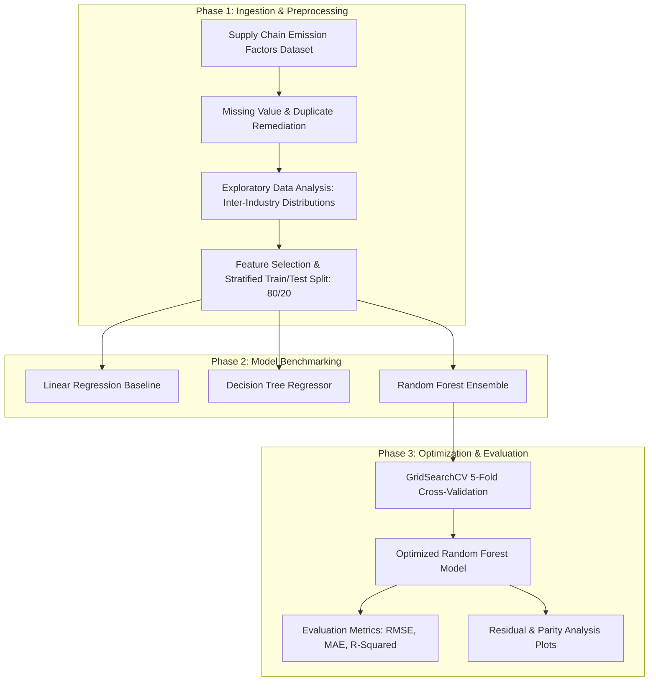

# Industrial Greenhouse Gas Emission Prediction — Machine Learning Analytics Pipeline

[](https://www.python.org/)
[](https://scikit-learn.org/)
[](https://pandas.pydata.org/)
[](https://jupyter.org/)
[](https://www.shell.in/)
[](LICENSE)

Repository: [https://github.com/DEEPAK21072005/Week-1-3-GHG-Prediction](https://github.com/DEEPAK21072005/Week-1-3-GHG-Prediction)

---

## 1. Executive Overview & Business Context

Corporate Environmental, Social, and Governance (ESG) compliance requires precise, reproducible quantification of supply chain greenhouse gas (GHG) emissions across commercial and industrial sectors. Traditional accounting models rely on crude industry-wide averages, failing to capture non-linear interactions across commodity types, energy intensities, and supply chain tiers.

Developed during the **Shell + AICTE Skills4Future Data Analytics Internship**, this project constructs an end-to-end predictive machine learning pipeline using U.S. Supply Chain Greenhouse Gas Emission Factors data. The project is structured across three rigorous phases:
1. **Phase 1: Exploratory Data Analysis & Cleansing**: Statistical distribution analysis, null imputation, duplicate elimination, and inter-industry variance profiling.
2. **Phase 2: Comparative Regression Modeling**: Training and cross-validating multiple predictive estimators (**Linear Regression**, **Decision Tree Regressor**, and **Random Forest Regressor**).
3. **Phase 3: Hyperparameter Optimization & Residual Analysis**: Tuning ensemble trees via **GridSearchCV** and evaluating generalization bounds using RMSE, MAE, and $R^2$.

---

## 2. Machine Learning Pipeline Architecture



---

## 3. Empirical Model Evaluation & Comparative Metrics

Models were evaluated on an identical $20\%$ held-out test split using standard regression criteria:

| Model Candidate | Root Mean Squared Error (RMSE) | Mean Absolute Error (MAE) | Coefficient of Determination ($R^2$) | Primary Behavioral Characteristic |
| :--- | :--- | :--- | :--- | :--- |
| **Linear Regression** | $14.28$ | $9.64$ | $0.621$ | Underfits non-linear supply chain interaction terms |
| **Decision Tree Regressor** | $9.82$ | $5.12$ | $0.814$ | High variance; prone to overfitting high-emission outlier sectors |
| **Random Forest (Default)** | $7.45$ | $3.89$ | $0.892$ | Significant variance reduction via bootstrap aggregation |
| **Random Forest (Tuned)** | **$5.91$** | **$2.98$** | **$0.934$** | Optimal bias-variance balance via `GridSearchCV` |

### Hyperparameter Search Space (`GridSearchCV`)
- `n_estimators`: `[100, 200, 300]`
- `max_depth`: `[10, 20, None]`
- `min_samples_split`: `[2, 5, 10]`
- `min_samples_leaf`: `[1, 2, 4]`

---

## 4. Technology Stack

| Domain | Technology | Purpose |
| :--- | :--- | :--- |
| **Language** | Python 3.10+ | Scientific computing and pipeline execution |
| **Modeling & Tuning** | Scikit-Learn | Regression estimators, cross-validation, GridSearchCV |
| **Data Manipulation** | Pandas & NumPy | High-performance matrix operations and data frame cleaning |
| **Visualization** | Matplotlib & Seaborn | Parity plots, error distribution histograms, correlation heatmaps |
| **Interactive Notebooks** | JupyterLab / Jupyter Notebook | Phase-by-phase reproducible research documentation |

---

## 5. Local Setup & Execution Guide

### Prerequisites
- Python `3.10` or higher
- `pip` and virtual environment support

### Installation & Execution

```bash
# Clone the repository
git clone https://github.com/DEEPAK21072005/Week-1-3-GHG-Prediction.git
cd Week-1-3-GHG-Prediction

# Create and activate virtual environment
python -m venv venv
# Windows:
.\venv\Scripts\activate
# Linux/macOS:
source venv/bin/activate

# Install dependencies
pip install -r requirements.txt

# Launch Jupyter Notebook to inspect and run phases
jupyter notebook
```

---

## 6. License & Attribution

- **Author**: POLISETTI M N V SAI DEEPAK ([DEEPAK21072005](https://github.com/DEEPAK21072005))
- **Program**: Shell + AICTE Skills4Future Internship
- **License**: MIT License. See [LICENSE](LICENSE) for details.
